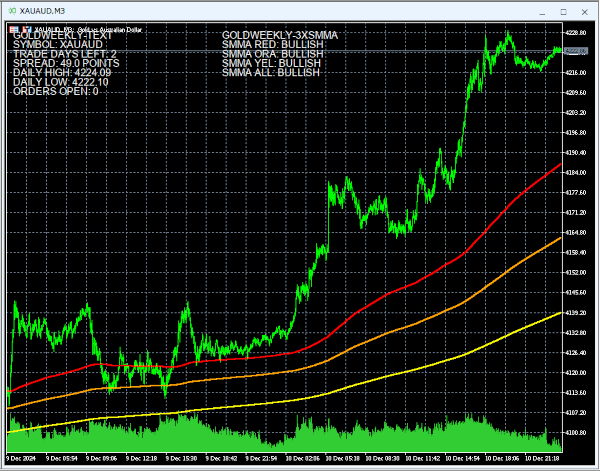

# GoldWeekly-Mt5
Status: Under Development

### Description
This is a project to create an interface for trading on MetaTrader 5, designed for trending pairs such as Gold, to use as clarification of confirmation for trading strategy, to make likelyhoods of safe trading directions more apparent; this is based on Manual trading which relies upon the trader's ability to recognize patterns in the market, therein,these patterns often have unexpected twists, but the likelyhood of, recouperating losses and avoiding bad trades, in the long term can be improved through the use of indicators.

### Features
The current detail of features is... 
- GoldWeekly-SmmaOnly - 3 Clear Smma with Overall Direction Text. 
- GoldWeekly-TextOnly - Text Info with, text position and font size.

### Preview
- Indicator - 3 Smma Only And Display Text...

## Instructions - Indicators
1. For files, copy the, Indicator and/or TextOnly, to the `./Mql5/Indicators/Custom` folder.
2. Open a Chart window in MetaTrader 5 on a trending pair, and copy the Indicator to a chart window in navigator.
3. Ensure to check the external inputs for font size/position.
4. Each Indicator will differ in purpose...
- Indicator - 3 thicker SMMA, 250 Red, 500 Orange, 1000 Yellow, the combined result is shown in the text of the indicator as DOWN or UP.
- Text only - Do not use with Indicator, as text display will have issues for now.

## Instructions - Advisors
1. For files copy the TextOnly to the `./Mql5/Indicators/Custom` folder.
2. Open a Chart window in MetaTrader 5 on a trending pair, and copy the Advisor to a chart window in navigator.
3. Ensure to check the external inputs for font size/position.
4. The Advisor has multiple-sections...
- TBA.  

## Notation
- The strategy for trading would rely upon recognizing patterns typically on M15-M30, then be confirming directions for optimal trading with indicators in combination with ones such as the ones supplied here. Smma, denotes if rebound is likely possible. 
- The Text I implement is, Good to know stuff and self explanitory. 
- When trading ensure to draw Lines on chart, to clarify patterns.
- I created this GPT Profile named [Mt5Mql5-4o1Mini](https://chatgpt.com/g/g-Un4YwjMNH-mt5mql5-4o1mini), for creating my, Indicators and Expert Advisor.

### Development
Current project details...
- Create Custom RSI Indicator...
1. Standard Rsi With double thickness line, defaults 30/65.
2. Implement Display Text "RSI LEVEL: UNDERSOLD/NEUTRAL/OVERSOLD   
- Expert Advisor - Supposedly as an EA able to display multiple indicators, and combine signals with graphic, however `EAs don’t automatically plot indicators like a custom indicator script would`, so, each indicator would have to be a specially coded....
1. Merge and Convert, 3xSmma and Rsi and Text, to Expert Advisor. This is done but its not right, and needs fixing or done again.

## Warnings
- Trading with specified method, in theory is supposed to work, but you should combine with other methods you are experimenting with or knowing of; this indicator will not guarantee success.
