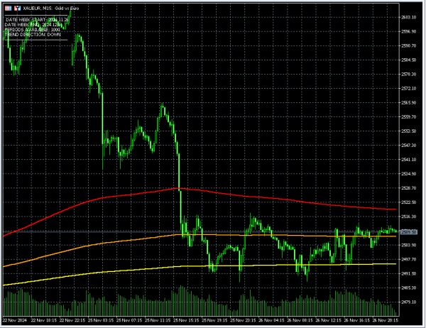

# GoldWeekly-Indicator
Its an  Indicator for Mt5, that enables hopefully more effective trading, written with, GPT4o and DeepSeek2.5.

### Description
- Indicators to use in Metatrader 5, designed for trending market, to use as confirmation for trading strategy, to make likelyhoods more apparent. Manual trading with the indicator provided relies upon the trader's ability to recognize patterns in the market, therein,but these patterns often have unexpected twists, but the likelyhood of, recouperating losses and avoiding bad trades, can be improved through the use of indicators, at least thats how the theory goes.

### Features
The current detail of features is...
- GoldWeekly-TextDisplay - useful info such as, periods since week start max 1000, week date start/end.  
- GoldWeekly-3xSmma - 3 color smma trends, Red is Fast, Orange is Medium, Yellow is Slow, with default line thickness 2. 

### Preview
- Roughly the stage I am at...

## Instructions
With this combination indicators, the strategy for trading would rely upon recognizing patterns, then when you recognize a pattern, you must be confirming directions for optimal trading with indicators. 
- Smma - denotes if rebound is likely possible.
- Text - Good to know stuff, for piece of mind..
- Rsi (built in Mt5) - is like market pressure, when too far over one side, it will likely go to direction of other side at some point after.

### Development
Current project details...
- halted, because, 1) cant have multiple different types of indicators in 1 indicator as intended, and 2) GPT4o and DeepSeek2.5 are unable to draw Rsi on main chart. Work below is not done until re-visit.
- GoldWeekly-Rsi - the rsi, for now just use normal Rsi Built-in.
- Not done - rsi as overlay on main chart. cant be done with, gpt4o and deepseek2.5, or with additional research. The idea was to have Rsi with colors indicating if the direction the rsi is going in is going in same direction as combined smma trend result.
- Not done - Display Text with resize; resizeable text is more tricky than first expected, it requires text objects, which, gpt and deepseek2.5, dont get right. 
- Not done - Re-visit the display text, and add other useful non-indicator based information.

### Warnings
- Trading with specified method, in theory is supposed to work, but you should combine with other methods you are experimenting with or knowing of; this indicator will not guarantee success.
