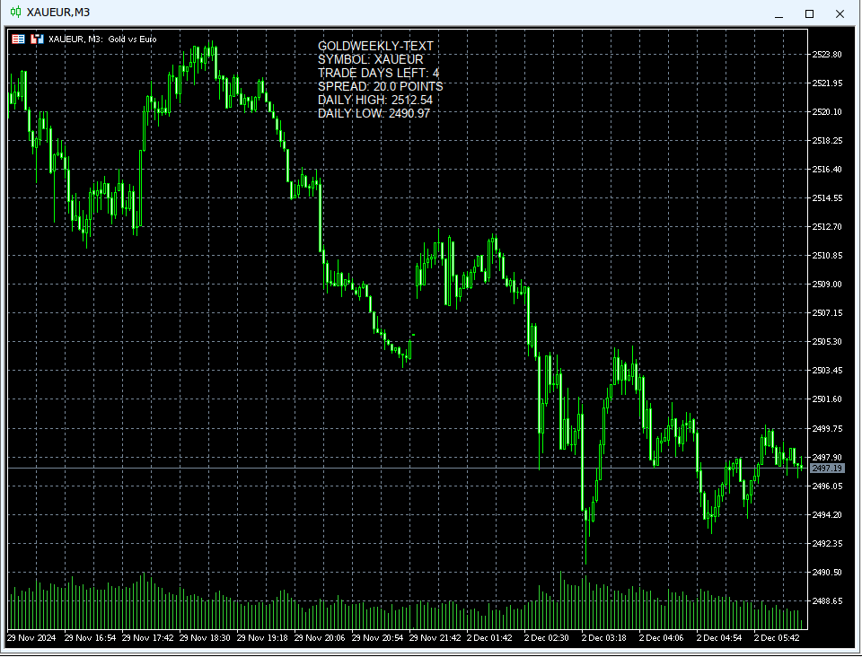

# GoldWeekly-Mt5
Status: Indicator = Beta
 Status: Advisor = Alpha
 Status: TextOnly = Beta

### Development
I found out `EAs don’t automatically plot indicators like a custom indicator script would`, so, each indicator would have to be a complete custom indicator, or otherwise made as an EA. Current project details...
1. Convert Indicator to Expert Advisor. This is done but its not right, and needs fixing.
2. Add the rsi to main chart. Rsi is normally in a separate window, 
3. Enhanced Rsi. The idea was to have Rsi with colors indicating if the direction the rsi is going in is going in same direction as combined smma trend result. Rsi , is like market pressure, when too far over one side, it will likely go to direction of other side at some point after. 
4. Display Text with resize; resizeable text is more tricky than first expected, it requires text objects, which, gpt and deepseek2.5, dont get right. 

### Description
This is a project to create an interface for trading on MetaTrader 5, designed for trending pairs such as Gold, to use as clarification of confirmation for trading strategy, to make likelyhoods of safe trading directions more apparent; this is based on Manual trading which relies upon the trader's ability to recognize patterns in the market, therein,these patterns often have unexpected twists, but the likelyhood of, recouperating losses and avoiding bad trades, in the long term can be improved through the use of indicators.

### Features
The current detail of features is... 
- GoldWeekly-Advisor - In Progress. Supposedly as an EA able to display multiple indicators, and combine signals with graphic.
- GoldWeekly-Indicator - Simpler Display Text and the 3 Smma (Indicators are limited to 1 type of Indicator each). 
- GoldWeekly-TextOnly - Now featuring Text Objects, with, window position and font size. Here is only concise detail of useful info.

### Preview
- Indicator version; Limited to 3 Smma and Display Text due to Mt5...

- TextOnly version...

## Instructions
1. For files, copy the, Indicator and TextOnly, to the `./Mql5/Indicators/Custom` folder, and the EA to the `./Mql5/Expert Advisors/Custom` folder, then start/restart the program.  
2. Open a Chart window in MetaTrader 5 on a trending pair, and copy the, Advisor or Indicator, to a chart window in navigator.
3. Therein each will differ in purpose...
- Indicator - 3 thicker SMMA, 250 Red, 500 Orange, 1000 Yellow, the combined result is shown in the text of the indicator as DOWN or UP.
- Text only - Do not use with Indicator, as text display will have issues for now.

## Notation
- The strategy for trading would rely upon recognizing patterns typically on M15-M30, then be confirming directions for optimal trading with indicators in combination with ones such as the ones supplied here. Smma, denotes if rebound is likely possible. 
- The Text I implement is, Good to know stuff and self explanitory. 
- When trading ensure to draw Lines on chart, to clarify patterns.
- I created this GPT Profile named [Mt5Mql5-4o1Mini](https://chatgpt.com/g/g-Un4YwjMNH-mt5mql5-4o1mini), for creating my, Indicators and Expert Advisor.

## Warnings
- Trading with specified method, in theory is supposed to work, but you should combine with other methods you are experimenting with or knowing of; this indicator will not guarantee success.
